#### María Rodiguez Arango

##### Ejercicio 2 - almacenamiento


Creamos la carpeta saludo y dentro de ella un fichero index.html


Arrancamos los contenedores

contenedor c1

```
docker run -d --name c1 --mount type=bind,src=/home/maria/saludo,dst=/var/www/html -p 8181:80 php:7.4-apache
```

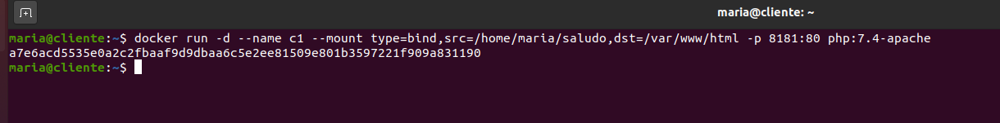

contenedor c2

```
docker run -d --name c2 --mount type=bind,src=/home/maria/saludo,dst=/var/www/html -p 8282:80 php:7.4-apache
```

y comprobamos que los contenedores se han creado

```
docker ps -a
```

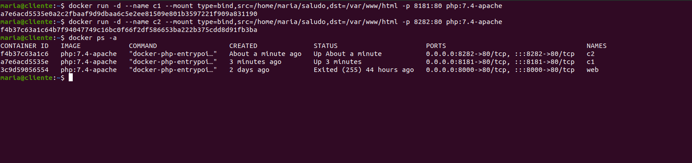


Comprobamos el contenido del contenedor c1 desde el navegador

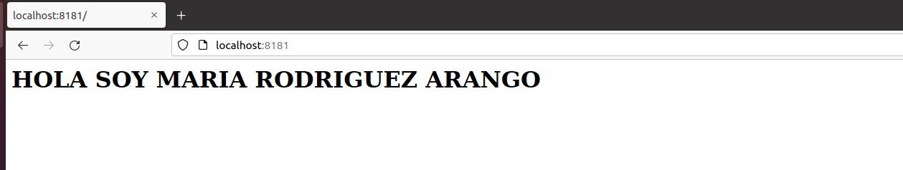


Comprobamos el contenido del contenedor c2 desde el navegador

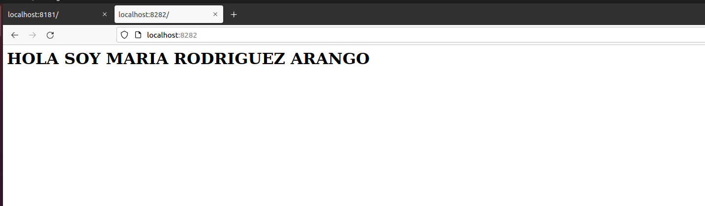


Ahora comprobamos desde  el terminal el contenido de ambos contenedores


```
docker exec -it c1 bash
```

```
cat index.html
```

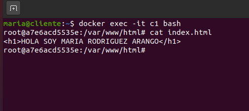

salimos del contenedor c1

```
exit
```

y comprobamos el contenido del c2

```
docker exec -it c2 bash
```

```
cat index.html
```

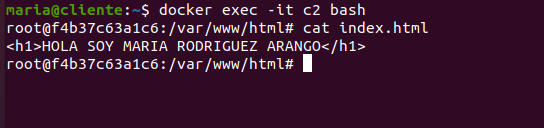

Modificamos el contenido del texto y mostramos el contenido nuevo primero desde el navegador y luego por terminal


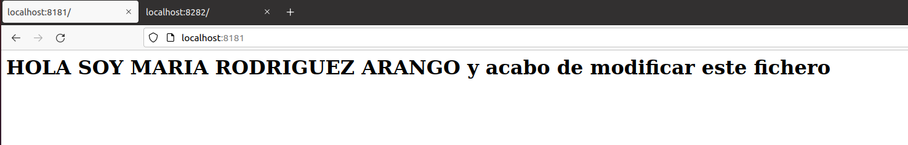


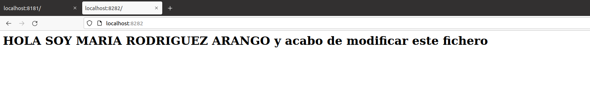

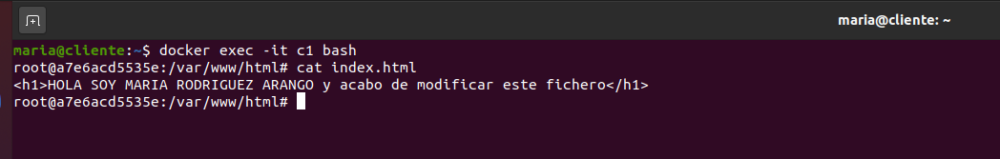


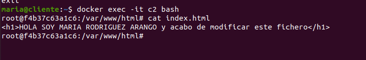


Comprobamos los contenedores que tenemos activos

```
docker ps
```

Paramos los contenedores c1 y c2

```
docker stop c1
```

```
docker stop c2
```

Comprobamos que los contenedores están parados

```
docker ps
```

Comprobamos los contenedores que tenemos

```
docker ps -a
```

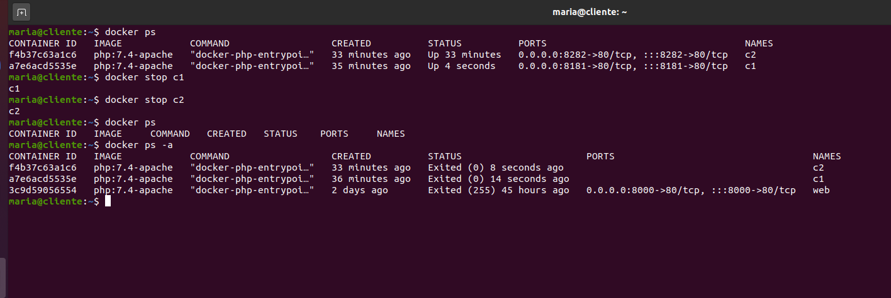

Borramos los contenedores c1 y c2 

```
docker container rm c1
```

```
docker container rm c2
```

Comprobamos que se han borrado los contenedores

```
docker ps -a
```

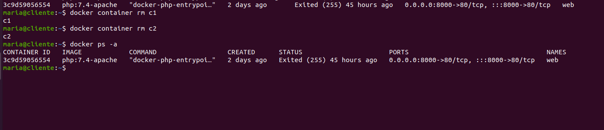
