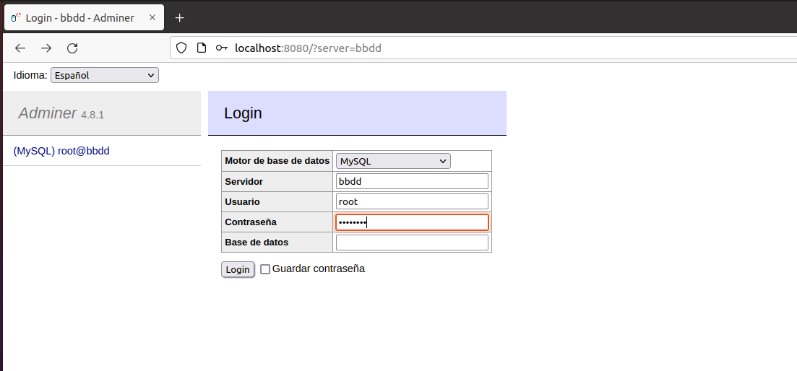

#### María Rodriguez Arango

##### Ejercicio 3 Redes

Creamos una red bridge "redbd"

```
docker network create redbd
```

listamos para ver que esta creada

```
docker network ls
```


Creamos un contenedor con una imagen de maridadb que esté en la red creada antes

```
docker run -d --name bbdd --network=redbd -v /home/maria/redes:/var/lib/mysql -e MARIADB_ROOT_PASSWORD=temporal -e MARIADB_DATABASE=maria -p 3306:3306 mariadb
```


Creamos un contenedor con Adminer que se pueda conectar al contenedor de la BD

```
docker run --name adminer --link bbdd:db --network redbd -p 8080:8080 -d adminer
```

Comprobamos que contenedores se esta ejecutando

```
docker ps
```


Accedemos a la interfaz de Adminer desde el navegador




Nos conectamos a la base de datos


Creamos una base de datos desde la interfaz de Adminer


Comprobamos por comandos que la base de datos MariaArango se ha creado correctamente

```
docker exec -it bbdd bash
```

dentro del contenedor de la base de datos  nos conectamos a la base de datos

```
mysql -u root -p
```

una vez comprobado que esta creada la base de datos salimos primero de la base de datos y después del contenedor

```
exit
```


Borramos los contenedores, la red y los volúmenes utilizados:

primero paramos los contenedores

```
docker stop bbdd
```

```
docker stop adminer
```

borramos los contenedores

```
docker container rm bbdd adminer
```

borramos la red

```
docker network rm redbd
```

borramos los volúmenes

```
docker volume prune
```

Comprobamos que todo se ha eliminado todo:

listamos los volúmenes, redes y contenedores

```
docker volume ls
```

```
docker network ls
```

```
docker ps -a
```

