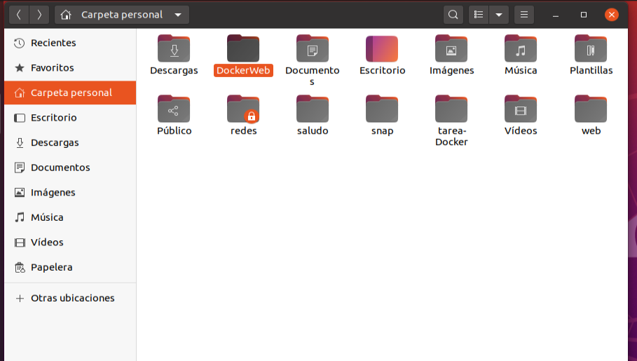

#### María Rodriguez Arango

##### Ejercicio 4 - imagen con Dockerfile


Creamos una carpeta : dockerweb



Nos descargamos una plantilla de la página  HTML5UP ,la personalizamos y guardamos dentro de la carpeta creada anteriormente.

Creamos el archivo plano Dockerfile y también lo guardamos dentro de la carpeta DockerWeb


 Construimos la imagen

```
docker build -t ejercicio4
```


Creamos el contenedor a través de la imagen anterior

```
docker run -d -p 80:80 ejercicio4
```


Mostramos el acceso al navegador con el sitio servido


Subimos la imagen a nuestra cuenta Docker Hub:

Iniciamos sesión en Docker Hub

```
docker login
```


Subimos la imagen

```
docker tag ejercicio4 mariarodriguezarango/ejercicio4
```

```
docker push mariarodriguezarango/ejercicio4
```


Comprobamos que la imagen esta subida

